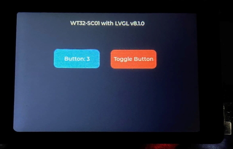

# Latest project with multiple device support is here
https://github.com/sukesh-ak/ESP32-TUX

# Graphics & Touch on WT32-SC01


 
- Board : WT32-SC01 from Wireless Tag (Seeed Studio also carries the same)  
  Similiar display from DFRobot uses ILI9488 (not ST7796S)
- Graphics & Touch Driver : [LovyanGFX](https://github.com/lovyan03/LovyanGFX)
- UI/Widgets : [LVGL8.x](https://github.com/lvgl/lvgl)
- Framework : Arduino + PlatformIO ([ESP-IDF sample here](https://github.com/sukesh-ak/LVGL8-WT32-SC01-IDF)) 

## Demo code output


## WT32-SC01 Specs  
#### Pros:  
- ESP32 WROVER-B
- 3.5" 480x320 ST7796S TFT Display
- Capacitive touchscreen FT6336U
- Default 4MB Flash & 8MB PSRAM
- Two external expansion female pin headers with same pin-out (mirrored)
- 2 x 3.3v LDO, 1 for the board and 1 for the external expansion
- Separate Battery/External power option with voltage range 5v-9v
- USB-C for power and programming

#### Cons:
- No SD Card storage option
- [16MB Flash version](https://www.alibaba.com/product-detail/esp32-development-board-WT32-SC01-3_62534911683.html) available but only through Alibaba (didn't know when I ordered)
- Pin headers are 2mm pitch which is not breadboard standard (2.54mm is common).
- Mounting holes in the wrong place so you cannot use it (fixed in newer revisions)

## Board config
- TFT (ST7796)
    - TFT_RST=22
    - TFT_SCLK=14
    - TFT_DC=21
    - TFT_CS=15
    - TFT_MOSI=13
    - TFT_MISO=-1
    - TFT_BCKL=23
- Touch	(FT6336U)
    - TOUCH_SDA=18
    - TOUCH_SCL=19
    - I2C_TOUCH_ADDRESS=0x38

## Touch and Draw sample (without LVGL)
Replace the content of main.cpp with the following to test quickly  
For `Ardiuno IDE`, install LovyanGFX library then copy & paste the below code into your .ino file and flash!
``` C++

/*
    Simple Touch Drawing sample for WT32-SC01
*/
#define LGFX_AUTODETECT     // Autodetect board
#define LGFX_USE_V1         // set to use new version of library

#include <LovyanGFX.hpp>    // main library

static LGFX lcd;            // declare display variable

// Variables for touch x,y
static int32_t x,y;

void setup(void)
{
  lcd.init();

  // Setting display to landscape
  if (lcd.width() < lcd.height()) lcd.setRotation(lcd.getRotation() ^ 1);

  lcd.setCursor(0,0);
  lcd.printf("Ready to touch & draw!");
}

void loop()
{
  if (lcd.getTouch(&x, &y)) {
    lcd.fillRect(x-2, y-2, 5, 5, TFT_RED);
    lcd.setCursor(380,0);
    lcd.printf("Touch:(%03d,%03d)", x,y);
  }
}

```

## 3D Printable enclosure (STL)  
[3D enclosure on SketchFab website](https://sketchfab.com/3d-models/wt32-sc01-case-cfec05638de540b0acccff2091508500)
